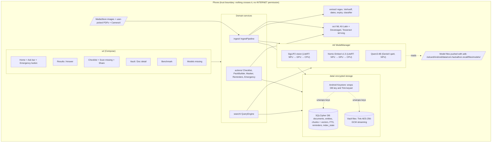
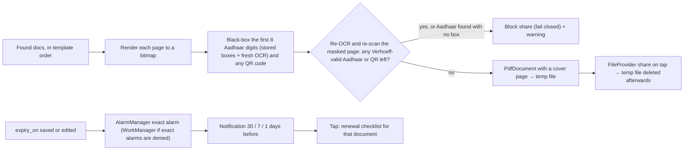

# iQOO Recall: architecture

iQOO Recall is a single Android app (Kotlin, Jetpack Compose) that runs fully offline. Nothing leaves the phone: the release build requests no `INTERNET` permission, every model runs on-device, and all document data is encrypted at rest.

## 1. Components and trust boundary



Each package has one job and talks to the others through small interfaces:

| Package | Responsibility | Key types |
|---|---|---|
| `model/` | Shared enums (DocType, Lang, …) | `DocType`, `Lang` |
| `extract/` | Pure text logic: digits, Verhoeff, entities, dates, expiry, doc type rules, owner, title | `EntityExtractor`, `DateParser`, `ExpiryPicker`, `DocClassifier` |
| `ml/` | Model loading, backend fallback, latency metrics, tokenizer, chunking | `ModelManager`, `SiglipVision`, `NomicEmbedder`, `QwenLlm`, `WordPieceTokenizer` |
| `ocr/` | Text and word boxes from bitmaps | `OcrEngine`, `OcrResult` |
| `data/` | Room over SQLCipher, FTS, vector index, encrypted file vault, keys | `RecallDb`, `DocumentRepository`, `VaultFileStore`, `KeyManager` |
| `ingest/` | One pipeline for gallery, camera and PDF; background scanning | `IngestPipeline`, `MediaStoreScanner`, `IndexWorker` |
| `search/` | Intent parse (LLM or rules), hybrid retrieval with RRF, grounded answers | `QueryEngine`, `IntentParser`, `HybridSearch`, `AnswerGenerator` |
| `actions/` | Templates, checklist, masked PDF packs, reminders, emergency | `ChecklistEngine`, `PackBuilder`, `AadhaarMasker`, `ReminderScheduler` |
| `ui/` | Screens and view models | `RecallNavHost` |

`AppContainer` (created in `RecallApp`) wires the singletons together. There is no DI framework.

## 2. Ingest flow (F1, F2, F3, F8)

```mermaid
flowchart LR
  Src["Gallery image / camera capture / PDF page"] --> Hash["SHA-256 of original bytes"]
  Hash -->|already stored| Skip1["Exact duplicate: mark done"]
  Hash --> Decode["Decode + downsample (EXIF-aware)"]
  Decode --> Gate{"SigLIP2 gatekeeper: top label is a document label and margin ≥ threshold?"}
  Gate -->|no, and not a screenshot/Downloads/WhatsApp Docs| Skip2["skipped_non_doc (user can 'Mark as document')"]
  Gate -->|yes or uncertain| OCR["OCR: ML Kit Latin + Devanagari; Tesseract tel+eng if < 40 useful chars"]
  OCR --> Ent["Entities: Aadhaar (Verhoeff), PAN, IFSC, vehicle, policy, ₹, phone, ABHA"]
  Ent --> Cls["Doc type: rules → SigLIP hint + keywords → Qwen (enum) → user"]
  Cls --> Dates["Dates: issued_on, expiry (rule, else Qwen picks a candidate index)"]
  Dates --> Near{"Near duplicate? SigLIP cos ≥ τ and OCR Jaccard ≥ 0.8"}
  Near -->|yes| Dup["Store with dup_of: 'already saved on <date>' → Keep both / Replace"]
  Near --> Chunk["Chunk OCR ≤ 110 tokens, 20 overlap"]
  Dup --> Chunk
  Chunk --> Emb["Nomic embed: 'search_document: ' + label + chunk"]
  Emb --> Store["One transaction: documents, entities, chunks, vectors, FTS, image vector"]
  Store --> Vault["Encrypted copy of original in vault"]
  Store --> Rem["Schedule reminders 30/7/1 days before expiry"]
```



Idempotency: every source URI has an `index_state` row (pending, done, failed or skipped_non_doc), and every document is keyed by the SHA-256 of its bytes. If the app is killed mid-item, that item stays `pending` and is processed again on the next run.

## 3. Query flow (F4, F5, F9)

```mermaid
sequenceDiagram
  participant U as User (EN / TE / HI, typed or spoken)
  participant QE as QueryEngine
  participant Q as Qwen (GenieX)
  participant R as RuleFallbackParser
  participant HS as HybridSearch
  participant DB as SQLCipher (FTS + vectors)
  participant N as Nomic

  U->>QE: "Home loan ki documents ready cheyyi"
  QE->>Q: intent JSON prompt (with today's date)
  alt valid JSON (one retry with the error message)
    Q-->>QE: {intent: pack, task_template: home_loan, answer_language: te, ...}
  else Qwen missing, slow, or invalid twice
    QE->>R: keyword lexicon + fuzzy match + date rules
    R-->>QE: QueryIntent (source = rules)
  end
  alt intent = pack / emergency
    QE-->>U: Checklist (found vs missing, counts, Scan missing, Share PDF)
  else find / question
    QE->>N: embed "search_query: " + query_en
    QE->>HS: FTS + cosine + doc-type ranking, then RRF (k = 60) and date filter
    HS->>DB: queries
    HS-->>QE: top 10 documents
    QE->>Q: answer only from the top 3 docs' OCR text; cite doc IDs
    Q-->>QE: {answer, cited_doc_ids}
    QE-->>U: answer in the user's language + source documents (invented IDs dropped)
  end
```

## 4. Sharing, masking and reminders (F5, F6, F7)



## 5. Security model (see docs/DECISIONS.md, D-001 and D-002)

- The SQLCipher database key is 256 random bits, wrapped by an AES-GCM key in the Android Keystore.
- Vault files are encrypted with Tink streaming AEAD. Its keyset is itself encrypted by a Keystore master key.
- `BiometricPrompt` (strong biometric or device credential) gates the UI. Emergency mode bypasses that gate for the health pack only, read-only, with Aadhaar always masked.
- `FLAG_SECURE` is set on vault screens. Release builds never log OCR text, IDs or names.
- There is no network path at all. The only input channels are MediaStore, the files the user picks, the camera, and model files placed in the app's own external directory.

## 6. Degraded modes (never fake output)

| Missing piece | What still works | What the UI shows |
|---|---|---|
| SigLIP2 model | Indexing uses an OCR text-density gate instead | "Gatekeeper: OCR fallback" |
| Nomic model | Keyword (FTS) and doc-type search; vectors are backfilled later | "Semantic search off" |
| Qwen bundle | Rule-based intent parsing; template answers listing the found documents | "Assistant: rules mode" |
| NPU delegate | GPU, then CPU | The backend actually used, on the Benchmark screen |
